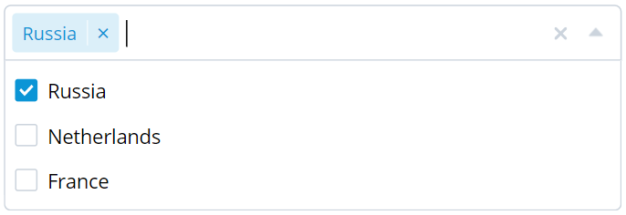

# Multiselect component for Vue 2

A multiselect component with support for Vue 2

## Install & basic usage

```shell
$ npm install vue-multiselect-component
```

```vue
<template>
  <VueMultiselectComponent
    v-model="selected"
    :options="options"
  />
</template>

<script>
import VueMultiselectComponent from 'vue-multiselect-component'

export default {
  components: {
    VueMultiselectComponent
  },
  data() {
    return {
      selected: [],
      options: [
        { id: 'ru', label: 'Russia' },
        { id: 'nl', label: 'Netherlands' },
        { id: 'fr', label: 'France' }
      ]
    }
  }
}
</script>
```

## Props

|Props|Description|Required|Type|Default|
|-----|-----------|--------|----|-------|
|value (v-model)|Selected items|true|Array|-|
|options|List of all items|true|Array|-|
|writable|The ability to write in the input field|false|Boolean|true|
|searchable|Standard element search (only for writable = true)|false|Boolean|true|
|placeholder|Input placeholder|false|String|-|
|loading|Options list standby mode|false|Boolean|false|
|limit|Limit the number of visible items when the options list is closed|false|Number|10|

**will be complemented*

## Events
|Event|Description|Attributes|
|-----|-----------|-----|
|search-change|Called whenever the search field has changed|(search-query)|
|input|Called whenever the value changes passing the new value|(value-list)|
|selected|Called whenever an element is selected|(id)|
|removed|Called whenever an element is removed|(id)|
|open|Called whenever the list is opened|-|
|close|Called whenever the list is closed|-|

**will be complemented*

## License

Copyright (c) 2021-present [Anatoliy Vasilyev](https://github.com/vas11yev1work).

Released under the [MIT License](https://github.com/vas11yev1work/vue-multiselect-component/blob/main/LICENSE).
